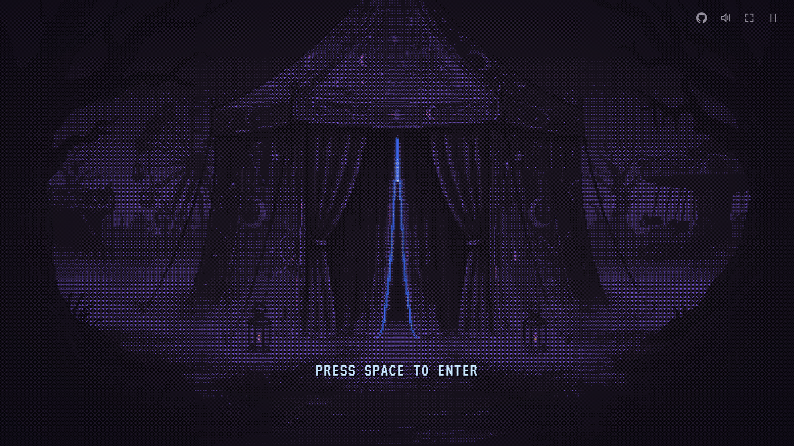
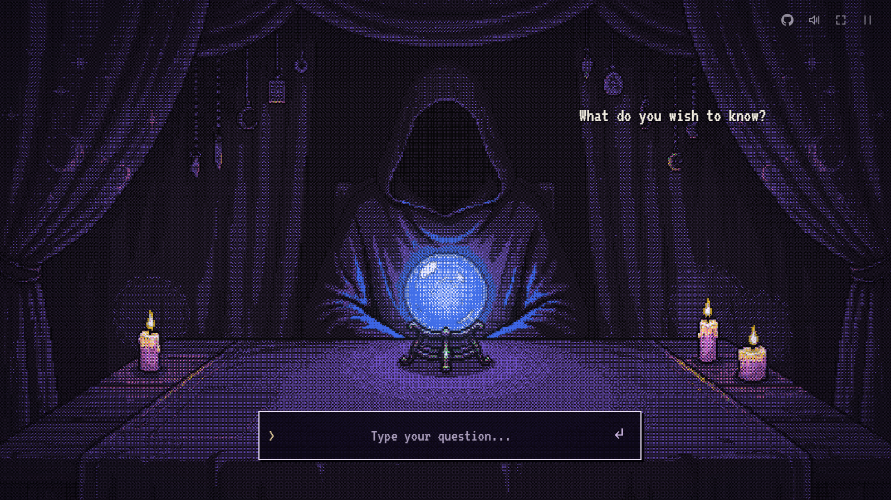
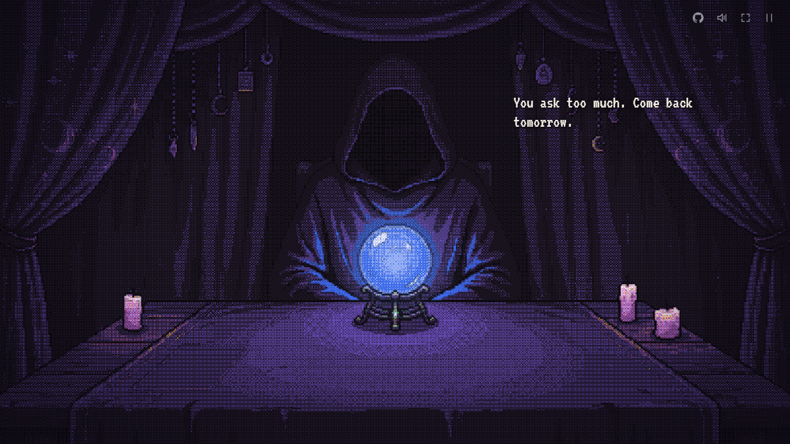
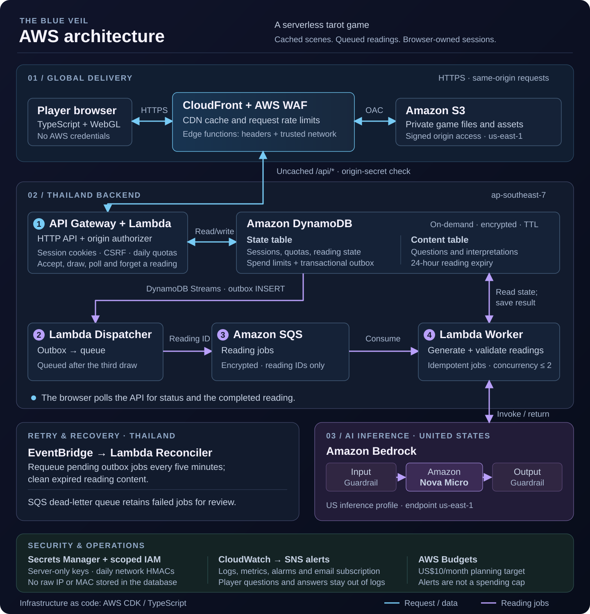

# The Blue Veil

_Three cards. Three candles. One question on your mind._



At the edge of a silent fairground, a blue light slips through the curtains of a small tent. The wind moves the fabric. Someone is waiting inside.

Press **Space** and walk in. Across the table sits a hooded figure whose face you cannot see. A blue orb glows between you, beside a deck of cards and three burning candles.

> “What do you wish to know?”

Ask your question. Draw three cards. Watch the orb stir as the reader considers your spread, then listen as each card becomes part of your answer. When the reading is over, you can return to a card, sit with its meaning, or ask again—while a candle still burns.

**The Blue Veil** is an atmospheric browser tarot game about curiosity, uncertainty, and a quiet conversation with a stranger. Its readings are for entertainment and reflection.

## Step inside

1. **Enter the tent.** Press Space or tap the entrance. Use the fullscreen button for a closer view.
2. **Ask a question.** Type what is on your mind and press Enter.
3. **Draw your cards.** Click the deck three times. Each card slides onto the table and turns over.
4. **Wait for the reader.** The orb brightens and hums before the interpretation begins.
5. **Explore the reading.** Each card appears in the center with its own aura. Use Back and Next to follow the reading, or select a card on the table to inspect it again.



Sound begins with your first interaction. Headphones help bring out the wind, footsteps, paper sounds, and the reader's voice blips.

### Three candles

Each accepted question extinguishes one candle. After the third, the reader has only one thing left to say:

> “You ask too much. Come back tomorrow.”



The allowance resets at **midnight in Bangkok**. There are three questions per browser each day, plus a shared three-question allowance for the same network. People on the same Wi-Fi may share those candles; opening an incognito window does not reset the network allowance.

## Features

- **A complete 78-card deck.** All 22 Major Arcana and the four Minor Arcana suits, with upright and reversed interpretations and a browsable gallery.
- **A living pixel-art scene.** Moving curtains, a faceless reader, blue orb light, and candle flames, with the pixel effect applied live in the browser.
- **Cards that feel physical.** A layered deck, sliding draws, three-dimensional flips, table shadows, and a paper flick when you inspect a card.
- **A mood for every card.** Enlarged artwork and individual aura colors accompany the explanation, from the warmth of The Sun to the cooler tones of Death.
- **A reader with a voice.** Text appears with original synthesized blips, supported by wind, footsteps, candle snuffs, card sounds, and the orb's hum.
- **Music inside the tent.** Scott Buckley's _A Dragon's Lullaby_ plays quietly beneath the dialogue and ritual.
- **Return to your reading.** Resume an unfinished spread, revisit its interpretation for up to 24 hours, or choose to forget it.
- **Desktop and touch controls.** Fullscreen, mute, pause, and reduced-motion support are built in.

## Controls

| Action                            | Control                      |
| --------------------------------- | ---------------------------- |
| Enter the tent                    | Space or tap the entrance    |
| Submit a question                 | Enter or the submit button   |
| Add a line to your question       | Shift + Enter                |
| Draw a card                       | Click or tap the deck        |
| Reveal text / advance the reading | Space or click the dialogue  |
| Navigate completed dialogue       | Back / Next buttons          |
| Inspect a revealed card           | Click or tap the card        |
| Pause / open the menu             | Esc or the menu button       |
| Toggle sound / fullscreen         | Speaker / fullscreen buttons |

## Inspiration

### DAVE THE DIVER

The rich pixel-art atmosphere: detailed little spaces, expressive lighting, and enough movement to make a scene feel alive. That influence carries into the tent's colors and the small details around the table.

<a href="https://store.steampowered.com/app/1868140/DAVE_THE_DIVER/">
  
</a>

### Undertale

The rhythm of dialogue and those little voice blips that give written words a personality. The hooded reader speaks through text and original synthesized sounds, letting the pauses do some of the acting.

<a href="https://store.steampowered.com/app/391540/Undertale/">
  
</a>

### Balatro

The satisfying movement of cards: how a small lift, slide, turn, or landing can make a simple action feel good. That attention to motion inspired the deck, draws, and card inspection.

<a href="https://store.steampowered.com/app/2379780/Balatro/">
  
</a>

### Papers, Please

The viewpoint from one side of a desk, with a character facing you and the important objects within reach. The Blue Veil uses that intimate table perspective to keep your attention on the reader, the orb, and the cards.

<a href="https://store.steampowered.com/app/239030/Papers_Please/">
  
</a>

### The Quarry

The encounters with the fortune teller, Eliza, and the uneasy feeling of having someone read your tarot cards. That mysterious pause between revealing a card and hearing what it means helped shape the reader and the orb ritual.

<a href="https://store.steampowered.com/app/1577120/The_Quarry/">
  
</a>

The promotional images above link to their respective games and belong to their respective rights holders.

## Art, music & credits

### The tent and the cards

The scenes use owner-supplied AI-generated artwork and animation. The 78 card faces were generated for The Blue Veil with OpenAI image generation and selected individually for the deck. The card back is from [Pixel Tarot Deck by Chorline](https://chorline.itch.io/pixeltarotdeck), used unchanged from a purchased copy.

### The pixel effect

The live scene shader is adapted from [Video-to-Pixel-Art](https://collidingscopes.github.io/video-to-pixel-art/) by **Alan Ang / [collidingScopes](https://github.com/collidingScopes)**. Thank you for sharing the tool that helped shape this game's look. The effect runs locally over the original video masters, preserving them without another compressed export. The [upstream MIT notice](public/licenses/video-to-pixel-art-MIT.txt) is included.

### Background music

**“A Dragon's Lullaby” by Scott Buckley** — released under [CC BY 4.0](https://creativecommons.org/licenses/by/4.0/). [www.scottbuckley.com.au](https://www.scottbuckley.com.au/).

The game uses the [2023 Remaster](https://www.scottbuckley.com.au/library/a-dragons-lullaby-2023/). The original audio file is unchanged; volume changes and repeat fades happen during playback. See the [attribution notice](public/licenses/a-dragons-lullaby.txt) and [full license](public/licenses/CC-BY-4.0.txt).

### Sound, type & icons

Voice blips and gameplay sound effects are synthesized locally for this project. The pixel font is **VT323**, under the [SIL Open Font License](public/assets/fonts/OFL.txt). The GitHub mark comes from **Octicons**, under its [MIT license](public/licenses/octicons-MIT.txt).

Full asset provenance and distribution notes are in [ASSET_LICENSES.md](ASSET_LICENSES.md).

## Run locally

The local game uses **sample readings** and needs no AWS credentials. Install Node.js **22.12 or newer** and npm. Asset import also requires FFmpeg with libwebp.

**A fresh checkout needs the game assets separately.** Card artwork, generation prompts, and all runtime deck versions are kept private for a planned commercial asset pack. The purchased back and scene assets also have separate distribution terms. Follow the [development guide](docs/DEVELOPMENT.md#run-locally) and [asset notes](ASSET_LICENSES.md) to prepare your local assets.

Once the assets are in place:

```sh
npm ci
npm run assets:check
npm run dev
```

Open [localhost:5173](http://localhost:5173/). Local state and its network key stay in ignored `.private/` files. All local browsers share the loopback network allowance.

## AWS backend

The live game uses **CloudFront and private S3** for delivery, an **API Gateway HTTP API and Lambda** in **Thailand (`ap-southeast-7`)**, and **Amazon Nova Micro** through Bedrock's US inference profile (`us.amazon.nova-micro-v1:0`). Versioned Bedrock Guardrails check both questions and generated interpretations. Local development uses sample readings.

<a href="docs/images/aws-architecture.svg">
  
</a>

[Open the full-size architecture diagram](docs/images/aws-architecture.svg).

When the third card is drawn, the API writes a **DynamoDB transactional outbox** record. A stream-triggered dispatcher sends the reading ID to **SQS**, and a worker generates and validates the interpretation before saving it in DynamoDB. The browser polls the API while the orb animation plays. A scheduled reconciler recovers pending work and removes expired content; a dead-letter queue retains failed jobs for review.

Anonymous abuse limits use daily secret-keyed network identifiers, encrypted DynamoDB storage in AWS, and a server-only Secrets Manager key. Raw IP and MAC addresses are not saved in the game database. VPNs or changing networks can bypass the network allowance; reading ownership remains private to each browser session.

The AWS planning target is **US$10/month**, not a guaranteed bill or hard spending cap. Usage and small ongoing service costs both matter. See the [development guide](docs/DEVELOPMENT.md#deployment) for the cost notes.

## Development & documentation

- [Development guide](docs/DEVELOPMENT.md) — asset import, rendering/audio details, and build/test commands.
- [Deployment guide](docs/DEPLOYMENT.md) — AWS CLI preflight, region gate, and deployment order.
- [Validation](docs/VALIDATION.md) — completed checks and remaining release work.
- [Security](SECURITY.md) and [network limits](docs/NETWORK_LIMITS.md) — protections, privacy, and anonymous-play tradeoffs.
- [Game plan](GAME_PLAN.md) and [implementation backlog](IMPLEMENTATION_BACKLOG.md) — design and upcoming work.

The source code is available under the [MIT license](LICENSE). Third-party assets retain their own licenses. The private generated card pack and purchased card artwork are not included in that license or this repository.
